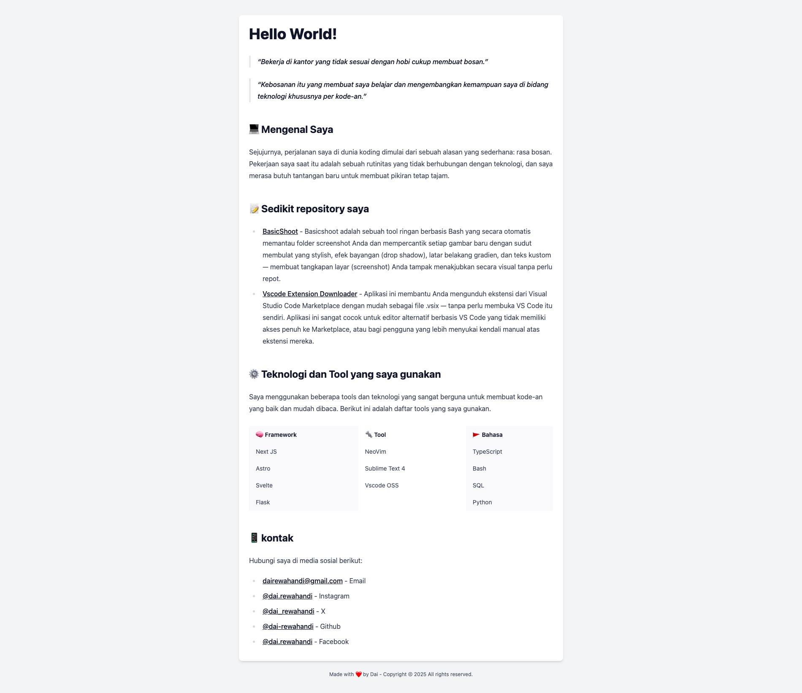

# readme-mdx

Project ini pakai [mdx](https://mdxjs.com/) untuk membuat readme dengan [tailwindcss](https://tailwindcss.com/) dan [vite](https://vitejs.dev/).

## Getting Started

### Installation

```bash
git clone https://github.com/dai-rewahandi/readme-mdx.git

cd readme-mdx

bun install

bun run dev
```

### Preview

[me.dairewahandi.or.id](https://me.dairewahandi.or.id)




## License

MIT


## Packages
- [mdx](https://mdxjs.com/)
- [mdx-js/rollup](https://mdxjs.com/packages/rollup/)
- [mdx-js/react](https://mdxjs.com/packages/react/)
- [remark-gfm](https://github.com/remarkjs/remark-gfm)
- [tailwindcss](https://tailwindcss.com/)
- [tailwindcss-typography](https://github.com/tailwindlabs/tailwindcss-typography)
- [prettier](https://prettier.io/)
- [prettier-plugin-sort-imports](https://github.com/trivago/prettier-plugin-sort-imports)
- [prettier-plugin-tailwindcss](https://github.com/tailwindlabs/prettier-plugin-tailwindcss)
- [vite](https://vitejs.dev/)
- [react](https://reactjs.org/)
- [typescript](https://www.typescriptlang.org/)