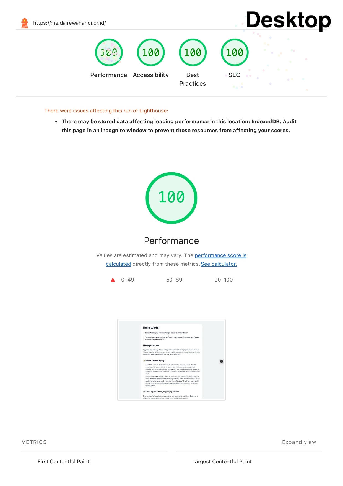
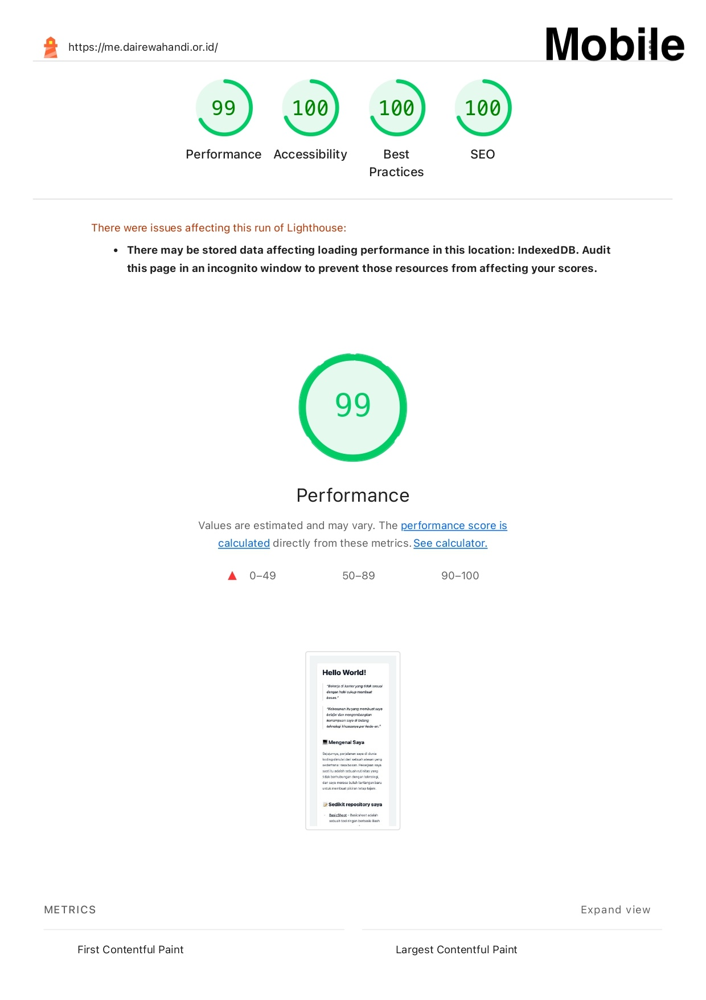

# readme-mdx

Project ini pakai [mdx](https://mdxjs.com/) untuk membuat readme dengan [tailwindcss](https://tailwindcss.com/) dan [vite](https://vitejs.dev/).

## Getting Started

### Installation

```bash
git clone https://github.com/dai-rewahandi/readme-mdx.git

cd readme-mdx

bun install

bun run dev
```

### Preview

[me.dairewahandi.or.id](https://me.dairewahandi.or.id)


### Performance





### Packages

```json
{
  "dependencies": {
    "@mdx-js/mdx": "^3.1.1",
    "@mdx-js/react": "^3.1.1",
    "@mdx-js/rollup": "^3.1.1",
    "@tailwindcss/typography": "^0.5.16",
    "@tailwindcss/vite": "^4.1.13",
    "prettier": "^3.6.2",
    "prettier-plugin-sort-imports": "^1.8.8",
    "react": "^19.1.1",
    "react-dom": "^19.1.1",
    "remark-gfm": "^4.0.1",
    "tailwindcss": "^4.1.13"
  },
  "devDependencies": {
    "@eslint/js": "^9.33.0",
    "@types/react": "^19.1.10",
    "@types/react-dom": "^19.1.7",
    "@vitejs/plugin-react": "^5.0.0",
    "eslint": "^9.33.0",
    "eslint-plugin-react-hooks": "^5.2.0",
    "eslint-plugin-react-refresh": "^0.4.20",
    "globals": "^16.3.0",
    "prettier-plugin-tailwindcss": "^0.6.14",
    "typescript": "~5.8.3",
    "typescript-eslint": "^8.39.1",
    "unplugin-inject-preload": "^3.0.0",
    "vite": "^7.1.2"
  }
}
```
